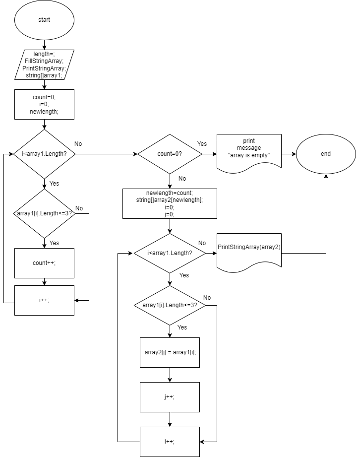

## Контрольная Работа

> **Задача**
Написать программу, которая из имеющегося массива строк формирует
массив строк, длинна которых меньше либо равна три символа.
Первоначальный массив можно ввести с клавиатуры либо задать на старте выполнения алгоритма.
рекомендуется использование массивов.

**Разработана схема алгоритма**

